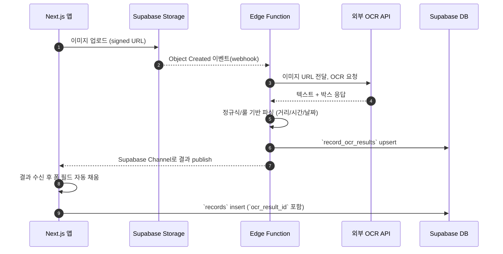

# OCR 파이프라인 설계 (v1)

## 1. 목표
- 1차 릴리즈에서 업로드된 운동 기록 이미지를 자동으로 분석하여 거리, 시간, 날짜, 페이스를 추출.
- 최소 비용을 위해 외부 SaaS API 1종만 사용, 실패 시 수동 입력으로 대체.

## 2. 구성 요소
1. **Supabase Storage**: `records-raw` 버킷에 원본 이미지 저장.
2. **Edge Function `ocr-ingest`**: 업로드 이벤트를 수신하여 OCR API 호출 및 결과 파싱.
3. **OCR Provider**: 후보(네이버 Clova OCR, Google Vision, AWS Textract). 비용/정확도 비교 후 하나 선택.
4. **Postgres 저장 구조**:
   - `record_ocr_results` 테이블: 업로드 경로 기준으로 OCR 결과 저장.
   - `records` 테이블: 최종 제출 시 `ocr_result_id`로 결과 참조, 거리/시간 확정.

## 3. 플로우

## 4. 파싱 로직
- 거리: `([0-9]+(\.[0-9]+)?)\s?(km|KM|Km)` 패턴.
- 시간: `([0-9]{1,2}:[0-5][0-9]:[0-5][0-9])` → 초 단위 변환.
- 날짜: `YYYY.MM.DD`, `YYYY- MM-DD`, `MM/DD` 등 여러 패턴 허용.
- 예외 시 신뢰도 낮음으로 간주하고 사용자 입력 필요.

## 5. 보안 및 비용
- Edge Function에서 서비스 키 사용, 외부 API 키는 Vault/환경 변수로 관리.
- 일일 호출량 제한 설정, 초과 시 수동 입력 fallback 안내.

## 6. 모니터링 & 로깅
- Edge Function 로그를 Supabase Dashboard에서 확인.
- 실패 이벤트는 `record_ocr_results`의 `confidence=0`으로 기록하고 별도 뷰로 관리자에게 노출.

## 7. TODO
- [ ] OCR Provider 최종 선택 및 비용 산출.
- [ ] Edge Function 프로토타입 작성 (`supabase/functions/ocr-ingest/index.ts`).
- [ ] 정규식 파서 단위 테스트 추가.
- [ ] 프런트 채널 구독 로직 구현 (`supabase.channel('record-ocr')`).
