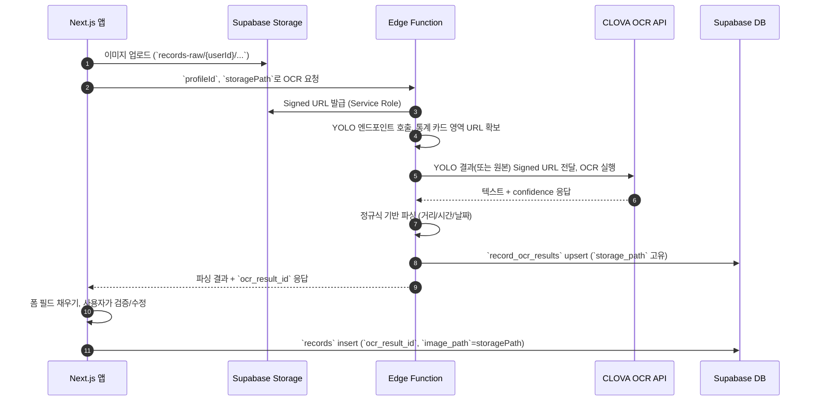

# OCR 파이프라인 설계 (v1)

## 1. 목표
- 1차 릴리즈에서 업로드된 운동 기록 이미지를 자동으로 분석하여 거리, 시간, 날짜, 페이스를 추출.
- 최소 비용을 위해 외부 SaaS API 1종만 사용, 실패 시 수동 입력으로 대체.

## 2. 구성 요소
1. **Supabase Storage**: `records-raw` 버킷에 원본 이미지 저장.
2. **Edge Function `ocr-ingest`**: 업로드 이벤트를 수신하여 OCR API 호출 및 결과 파싱.
3. **OCR Provider**: 후보(네이버 Clova OCR, Google Vision, AWS Textract). 비용/정확도 비교 후 하나 선택.
4. **Postgres 저장 구조**:
   - `record_ocr_results` 테이블: 업로드 경로 기준으로 OCR 결과 저장.
   - `records` 테이블: 최종 제출 시 `ocr_result_id`로 결과 참조, 거리/시간 확정.

## 2-1. 환경 변수 및 시크릿 구성 (초안)
| 키 | 비고 |
| --- | --- |
| `OCR_PROVIDER` | 현재는 `clova` 고정. 추후 provider 스위치 확장을 대비해 Strategy 패턴에서 사용. |
| `CLOVA_OCR_INVOKE_URL` | NAVER CLOVA OCR 엔드포인트. 템플릿/일반 모델에 따라 URL 분리 가능. |
| `CLOVA_OCR_SECRET_KEY` | CLOVA OCR 인증 시 사용하는 `X-OCR-SECRET` 값. |
| `CLOVA_OCR_TEMPLATE_ID` | 템플릿 OCR 사용 시 필요. 일반 모델 사용 시 비워두고 코드에서 조건 분기. |
| `OCR_RESULT_CONFIDENCE_FLOOR` | 신뢰도 필터링 하한 (예: `0.4`). 실패 시 폼에 수동 입력 안내. |
| `SUPABASE_SERVICE_ROLE_KEY` | Edge Function이 DB에 결과를 upsert하기 위해 필요. 기존 시크릿을 재활용. |
| `SUPABASE_URL` | Supabase 프로젝트 REST 엔드포인트. |
| `OCR_STORAGE_BUCKET` | 기본값 `records-raw`. 버킷 변경 시에도 코드 수정 없이 대응. |
| `YOLO_ENDPOINT` | YOLO 전처리 API 엔드포인트. 설정 시 OCR 전에 관심 영역을 잘라냅니다. |
| `YOLO_API_KEY` | YOLO API 호출에 필요한 인증 토큰(선택). |

> 위 키들은 Supabase CLI의 `supabase secrets set`으로 Functions 환경에 등록한다. 로컬 개발 시에는 `.env.local`와 `supabase/functions/ocr-ingest/.env`에 동일 키를 정의해 Edge Function 로컬 실행과 Next.js 개발 서버 모두에서 접근 가능하도록 한다.

## 3. 플로우

## 4. 파싱 로직
- 거리: `([0-9]+(\.[0-9]+)?)\s?(km|KM|Km)` 패턴.
- 시간: `([0-9]{1,2}:[0-5][0-9]:[0-5][0-9])` → 초 단위 변환.
- 날짜: `YYYY.MM.DD`, `YYYY-MM-DD`, `MM/DD`, `YYYY년 M월 D일` 등 다양한 포맷 허용 후 ISO 변환.
- 예외 시 신뢰도 낮음으로 간주하고 사용자 입력 필요.

## 5. 보안 및 비용
- Edge Function에서 서비스 키 사용, 외부 API 키는 Vault/환경 변수로 관리.
- 일일 호출량 제한 설정, 초과 시 수동 입력 fallback 안내.

## 6. 모니터링 & 로깅
- Edge Function 로그를 Supabase Dashboard에서 확인.
- 실패 이벤트는 `record_ocr_results`의 `confidence=0`으로 기록하고 별도 뷰로 관리자에게 노출.

## 7. TODO
- [x] OCR Provider 최종 선택 및 비용 산출.
- [x] Edge Function 프로토타입 작성 (`supabase/functions/ocr-ingest/index.ts`).
- [ ] 정규식 파서 단위 테스트 추가.
- [ ] 프런트 채널 구독 로직 구현 (`supabase.channel('record-ocr')`).

## 8. 공급사 비교
| 항목 | **NAVER CLOVA OCR (Template/General)** | **Google Cloud Vision – Document Text** | **AWS Textract – Detect Document Text** |
| --- | --- | --- | --- |
| **강점** | 한국어/일본어 필기체 지원, 서울 리전, 템플릿 기반 필드 추출 UI 제공 | 100+ 언어, 광범위한 예제와 SDK, 빠른 글로벌 가용성 | 테이블/폼 구조 인식, AWS Lambda 등과 자연스러운 연동 |
| **약점** | 콘솔/문서 대부분 한글, 해외 리전에선 지연 발생, 템플릿 선행 설정 필요 | 한국어 필기체 정확도 낮음, 대용량 시 추가 구글 클라우드 셋업 필요 | 한국어 인식률 낮음, 서울 리전 미제공(아시아-태평양 도쿄 이용) |
| **지원 언어** | 한국어, 영어, 일본어(필기 포함) | 100+ 언어, 필기 일부(영/한 필기 제한) | 다국어 텍스트, 필기 지원 제한적 |
| **가격 (2024-09)** | 약 **$0.005/요청** (일반 모델 기준)¹ | **$1.50/1000페이지** (=$0.0015/페이지)² | **$1.50/1000페이지** (Detect API)³ |
| **월 1만장 예상** | ≈ **$50 (약 6.7만 원)** | ≈ **$15 (약 2만 원)** | ≈ **$15 (약 2만 원)** |
| **통합 난이도** | REST JSON, NCP 인증키 사용. 템플릿 생성까지 1~2일 | GCP 프로젝트/서비스 계정/청구 설정 필요 | AWS IAM/리전 설정 및 S3 연계 필요 |
| **비고** | 러닝 크루(국내 사용자)용으로 가장 높은 한글 정확도. OCR Studio에서 영역 설정 후 API 호출 | 글로벌 확장 시 후보. Vertex AI와 결합 가능 | 테이블/폼 추출이 필요할 때 고려. 지연 및 트래픽 비용 고려 |

¹ NAVER CLOUD Platform CLOVA OCR 일반 모델 기준. 최신 요금은 [ncloud.com/product/aiService/ocr](https://www.ncloud.com/product/aiService/ocr#price) 참고.  
² Google Cloud Vision Document Text Detection 0–1M 유닛 구간. 출처: [cloud.google.com/vision/pricing](https://cloud.google.com/vision/pricing).  
³ AWS Textract Detect Document Text (아시아 태평양: 도쿄) 0–1M 페이지 구간. 출처: [aws.amazon.com/textract/pricing](https://aws.amazon.com/textract/pricing/).

### 추천안
- **1차 릴리즈:** NAVER CLOVA OCR → 한글 기반 러닝 기록 이미지(앱/워치 캡처)의 인식률이 가장 높음. 템플릿 기반으로 거리/시간 필드의 위치를 선지정하고 API 응답에서 `inferText`를 파싱.
- **확장 대비:** OCR 호출 모듈을 Provider strategy 패턴으로 설계하여 Google Vision/AWS Textract로 대체 가능하도록 추상화 (`OCRProvider` 인터페이스 → `clova`, `gvision`, `textract`).
- **비용 관리:** 월 1만장 이하라면 CLOVA 비용이 다소 높으나, 한글 인식 정확도로 QA 비용 절감 기대. 2차로 글로벌 확장 시 Google Vision을 병렬 도입.

## 9. 권장 파이프라인
1. **YOLOv8 기반 영역 분리**
   - 커스텀 클래스: `stat_card`, `metric_block`, `map`, `feed` 등.
   - 입력 이미지에서 지도/피드 등 비필요 영역 제거 후 통계 카드 ROI만 추출.
2. **OCR 처리 전략**
   - 템플릿 적용 가능한 앱(코로스/가민): CLOVA Template OCR 호출.
   - 가변 레이아웃(스트라바 등): CLOVA General OCR → 정규식 후처리.
   - 실패/미지원 케이스: Google Vision Document Text로 재시도.
3. **후처리**
   - 거리, 시간, 페이스, 심박 등을 표준 단위(km, 초)로 변환.
   - 신뢰도/값 범위 검증 후 `record_ocr_results`에 저장.

## 10. 다음 단계
- [ ] 샘플 50장 이상 라벨링하여 YOLOv8 학습 데이터 구축.
- [ ] CLOVA Template OCR 도메인 생성 및 필드 매핑 정의.
- [x] Edge Function에서 CLOVA OCR 호출 흐름을 구현하고 `record_ocr_results` upsert.
- [x] Edge Function에서 YOLO 분기 → OCR 호출 → 결과 저장 POC 구현.
- [ ] Fallback Provider(Google Vision) 모듈화 및 신뢰도 비교 로깅.
