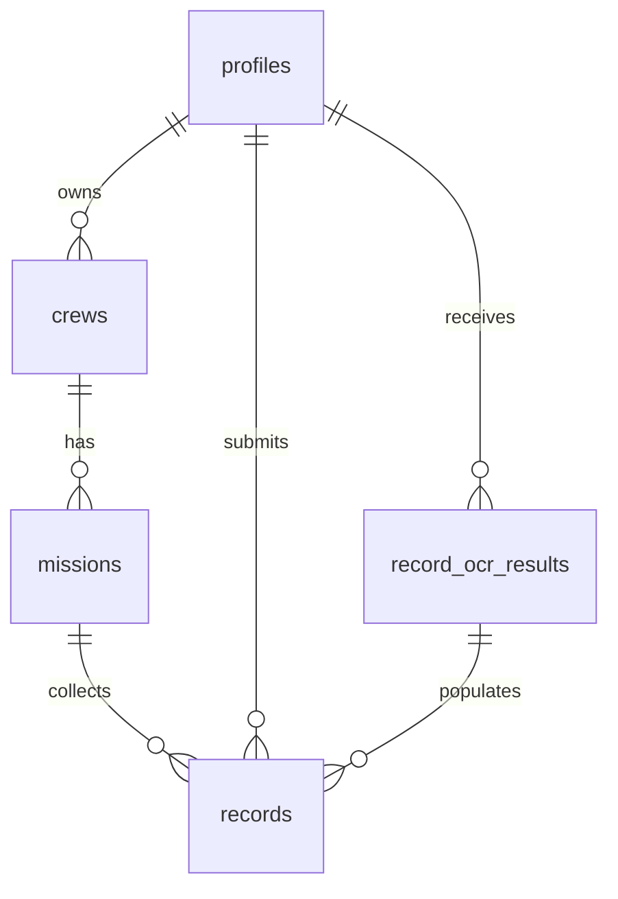

# 최소 스키마 v1 개요

## 1. 목표
- 1차 릴리즈에서 필수인 회원, 크루, 미션, 기록 데이터를 관리하고 OCR 결과를 저장할 수 있는 최소 구조.
- Supabase Postgres + RLS 정책으로 기본 보안 보장.
- 추후 확장(이벤트, 리액션, 실시간 알림)을 위해 참조 키와 시간 컬럼을 포함.

## 2. ERD 개요

## 3. 테이블 정의

### profiles
| 컬럼 | 타입 | 설명 |
| --- | --- | --- |
| `id` | uuid | `auth.users`와 동일, 기본 키 |
| `display_name` | text | 크루 내 표시명, 필수 |
| `avatar_url` | text | 프로필 이미지(선택) |
| `crew_role` | text | `member`/`admin`, 기본값 `member` |
| `bio` | text | 짧은 소개 |
| `created_at` | timestamptz | 생성 시각, 기본 `now()` |
| `updated_at` | timestamptz | 업데이트 시각, 기본 `now()` |

### crews
| 컬럼 | 타입 | 설명 |
| --- | --- | --- |
| `id` | uuid | 기본 키 |
| `owner_id` | uuid | 크루 생성자, `profiles.id` 참조 |
| `name` | text | 크루 이름, 고유 |
| `slug` | text | URL 식별자, 소문자/하이픈 규칙, 고유 |
| `description` | text | 크루 한 줄 설명 |
| `intro` | text | 상세 소개글 (마크다운 가능) |
| `logo_image_url` | text | 크루 로고 이미지 경로 |
| `location_lat` | numeric(9,6) | 주요 활동 위치 위도 |
| `location_lng` | numeric(9,6) | 주요 활동 위치 경도 |
| `created_at` | timestamptz | 생성 시각 |
| `updated_at` | timestamptz | 업데이트 시각 |

### record_ocr_results
| 컬럼 | 타입 | 설명 |
| --- | --- | --- |
| `id` | uuid | 기본 키 |
| `profile_id` | uuid | 업로드 사용자, `profiles.id` 참조 |
| `storage_path` | text | 업로드 파일 경로, 고유 |
| `raw_text` | text | OCR 원문 |
| `distance_km` | numeric(6,2) | 추출된 거리 |
| `duration_seconds` | integer | 추출된 시간(초) |
| `recorded_at` | timestamptz | 추출된 활동 시각 |
| `confidence` | numeric(3,2) | 0~1 신뢰도 |
| `created_at` | timestamptz | 생성 시각 |
| `updated_at` | timestamptz | 업데이트 시각 |

### missions
| 컬럼 | 타입 | 설명 |
| --- | --- | --- |
| `id` | uuid | 기본 키 |
| `crew_id` | uuid | 소속 크루, `crews.id` 참조 |
| `title` | text | 미션 제목 |
| `description` | text | 미션 상세(선택) |
| `start_date` | date | 시작일 |
| `end_date` | date | 종료일, 시작일 이상 |
| `target_distance_km` | numeric(6,2) | 목표 거리(선택) |
| `created_at` | timestamptz | 생성 시각 |
| `updated_at` | timestamptz | 업데이트 시각 |

### records
| 컬럼 | 타입 | 설명 |
| --- | --- | --- |
| `id` | uuid | 기본 키 |
| `profile_id` | uuid | 기록 작성자, `profiles.id` 참조 |
| `mission_id` | uuid | 대상 미션, `missions.id` 참조 |
| `ocr_result_id` | uuid | OCR 결과 참조, `record_ocr_results.id` |
| `recorded_at` | timestamptz | 활동이 끝난 시각 |
| `distance_km` | numeric(6,2) | 총 거리(km) |
| `duration_seconds` | integer | 총 시간(초) |
| `pace_seconds_per_km` | integer | 1km당 페이스(초) |
| `visibility` | text | `public` 또는 `private`, 기본 `public` |
| `notes` | text | 메모 |
| `image_path` | text | 업로드한 이미지 스토리지 경로 |
| `created_at` | timestamptz | 생성 시각 |
| `updated_at` | timestamptz | 업데이트 시각 |

## 4. 인덱스 & 파생 규칙
- `crews.owner_id`, `missions.crew_id`, `records.mission_id`, `records.profile_id`, `record_ocr_results.profile_id`에 인덱스 생성.
- 페이스는 거리-시간으로 기본 계산 후 수정 가능.
- `storage_path`는 Edge Function이 업로드 경로를 그대로 사용하여 중복 방지.
- `location_lat/location_lng`는 지도 컴포넌트를 위해 소수점 6자리까지 저장.

## 5. RLS 정책 요약
- `profiles`: 본인만 조회/수정.
- `crews`, `missions`: 전체 조회 허용, 소유자만 변경 가능.
- `record_ocr_results`: 본인만 조회/수정 가능, Edge Function(Service Role)은 RLS 우회.
- `records`: 본인 레코드는 CRUD 허용, `visibility='public'`은 모든 로그인 사용자가 조회 가능.

## 6. 오픈 이슈
- 크루 멤버십 및 승인 흐름을 위한 조인 테이블 필요 여부 (Phase 1 진입 전 결정).
- `updated_at` 자동 갱신 트리거는 차후 마이그레이션으로 추가.
- OCR 실패 시 재시도 정책과 결과 재사용 전략 확정 필요.
